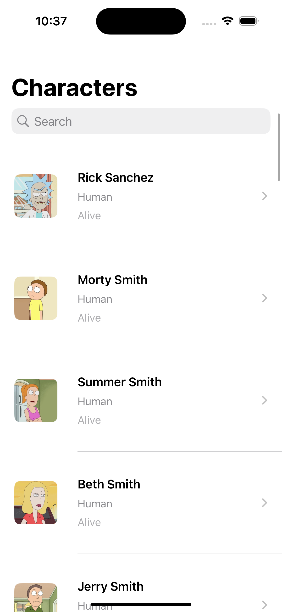
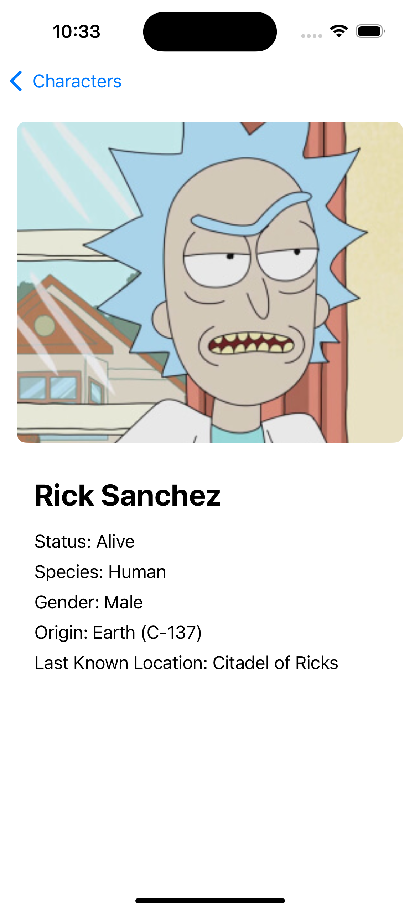

# Rick & Morty Character Viewer

A fully featured iOS app built with **SwiftUI**, showcasing scalable architecture, testability, and modern Swift practices using the Rick & Morty API.

---

## 🧠 About the Project

This app lists characters from the Rick & Morty universe with:

- Character list with infinite pagination
- Detailed view for each character
- Search by character name, status and species
- Asynchronous image loading and caching
- Structured concurrency with `async/await`
- Accessibility support

Built entirely in **SwiftUI**, this project demonstrates **MVVM architecture**, **SOLID principles**, modular design, and test-friendly service abstraction.

---

## 🛠 Architecture

The codebase is organized into:

- `Scenes/` – Feature-specific views and view models
- `Models/` – DataTransferObjs decoded from the API
- `Network/` – Abstracted service layer using generics and protocol-oriented networking
- `Common/` – Shared utilities and reusable components

The app uses:

- **MVVM** with protocol-based dependency injection
- **Actor-based concurrency** for thread-safe caching
- **Composable views** for modular UI structure

---

## ✅ Implemented Features

| Feature                            | Status |
| ---------------------------------- | ------ |
| Infinite pagination                | ✅      |
| Detail screen per character        | ✅      |
| Search by name, status and species | ✅      |
| Image caching and reuse            | ✅      |
| Structured concurrency             | ✅      |
| Accessibility support              | ✅      |
| Snapshot testing-ready views       | ✅      |
| Test-injected services             | ✅      |

---

## 🧪 Testing & CI

This project includes automated testing and CI integration to ensure quality and reliability:

### ✅ Unit Testing

- Implemented using Apple’s modern Swift Testing
- Focused on core logic including networking, error handling, and image caching.
- Built with testability in mind via protocol-based services and isolated components.

### ✅ UI Testing

- Snapshot-based UI testing is implemented using [SnapshotTesting](https://github.com/pointfreeco/swift-snapshot-testing) by Point-Free.

### ✅ Continuous Integration (CI)

- Powered by **Xcode Cloud**, integrated directly with **GitHub**.
- The project defines two test plans:
  - `Local` – runs full suite including snapshot tests.
  - `CI` – for Xcode Cloud, excluding snapshot tests due to simulator limitations.

> 📌 *Note: SnapshotTesting has some issue in Xcode Cloud environments because of Folder path. Since I couldn't fix it in a reasonable amount of time at the moment the CI plan avoids these tests to ensure stable, repeatable builds.*

---

## ⚙️ Technical Decisions

### 🧩 Rick & Morty API

The project originally planned to use the Marvel API, but due to instability and downtime, I switched to the **Rick & Morty API**, which provides rich, paginated character data in a developer-friendly format.

### 🧠 Exploring Beyond My Comfort Zone

While my background includes **UIKit + VIPER** and **SwiftUI + VIPER-State**, I intentionally used this project to explore a cleaner MVVM approach with:

- `async/await`
- SwiftUI-only view composition
- Lightweight, protocol-oriented architecture
- Actor-based services for safe shared state

---

## 📸 Screenshots

| List Character | Character Detail |
| ------ | ------ |
|||

## 🌊 Flow
| Flow |
| ------ |
||

---

##  🔧 Next Steps & Areas for Improvement

### 🧱 Overall Architecture

- **Improve Dependency Injection**  
  Currently manual — can be replaced with a lightweight DI framework or builder layer to manage dependencies cleanly.

- **Make Snapshot UI Tests Work in CI**  
  Currently skipped due to Xcode Cloud limitations. Explore GitHub Actions or local simulators via `xcodebuild` for full snapshot validation.

- **Add Code Coverage Reporting**  
  Integrate [Slather](https://github.com/SlatherOrg/slather) to track code coverage metrics in CI pipelines.

- **Add SwiftLint**  
  While the code is clean, using [SwiftLint](https://github.com/realm/SwiftLint) ensures standardization and helps avoid subtle mistakes, even in solo projects.

- **Analytics and Tracking**  
  Add hooks for analytics (e.g. screen visits, tap events) with protocols to keep layers decoupled.

- **Design System Foundation**  
  Introduce a simple design system for spacing, colors, fonts, and reusable UI components to improve consistency and scaling.

- **SwiftUI Previews**  
  Add `.preview` variants for each view to aid development and documentation — omitted here due to fast compile times.

---

### 💡 Specific Improvements

#### 📡 NetworkService

- Inject `URLSession` for better testability (mirroring `ImageService`)
- Improve error handling by mapping raw errors to custom, typed error enums

#### 🖼️ `CartoonPhotoCellView`

- Improve testability by isolating state and simplifying retry/image rendering logic

#### 🧪 UI Testing

- Extend UI tests to validate user flows (scrolling, tapping, error states), not just static rendering via snapshot tests
